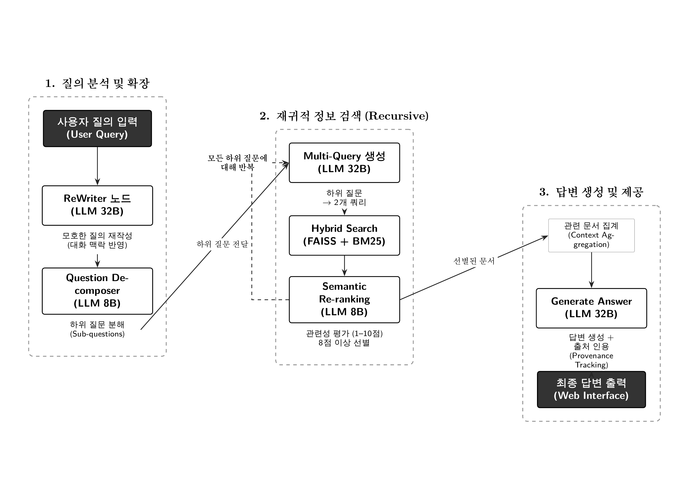

# Collaborators

- Mizrhan (Collaborator)
- sumkyun (Collaborator)

# 병무청 모집병 정보 제공 RAG 챗봇

## 1. 연구 개요

본 연구는 병역 의무를 앞둔 대한민국 청년들의 정보 접근성 제고를 목표로, 복잡한 병무청 모집병 관련 정보를 신속하고 정확하게 제공할 수 있는 지능형 대화 시스템을 설계 및 구현한다. 전통적인 검색 기반 정보 접근 방식이 가진 한계—즉, 사용자의 자연어 질의에 대한 적응성 부족, 문맥 이해 능력 결여, 정확도 향상의 한계—를 극복하기 위해 본 시스템은 **Retrieval-Augmented Generation (RAG)** 기술을 도입하였다.

특히, 본 시스템은 단순한 RAG 파이프라인을 넘어 **LangGraph** 기반의 상태 중심 워크플로우(State-based Workflow)를 채택하여 질문 재작성(Query Re-writing), 하위 질문 분해(Question Decomposition), 하이브리드 검색(Hybrid Retrieval), 의미적 리랭킹(Semantic Re-ranking)으로 이어지는 다단계 처리 파이프라인을 구현하였다. 사용자는 육군, 공군 등 각 군의 모집 분야, 지원 자격, 제출 서류, 최신 커트라인 등 병역 이행에 필요한 정보를 자연어 질의를 통해 획득할 수 있다. 시스템은 `data` 폴더에 저장된 공식 PDF 문서들에 기반하여 정확하고 신뢰성 있는 답변을 생성하며, 각 답변에 대해 출처 정보를 정밀하게 인용(Provenance Tracking)함으로써 투명성을 확보한다.




## 2. 시스템 아키텍처

본 시스템은 **Microservices Architecture**를 기반으로 설계되었으며, Docker Compose를 통해 세 가지 핵심 서비스로 구성된다: (1) LLM 서빙을 위한 vLLM 컨테이너, (2) 임베딩 생성을 위한 Ollama 컨테이너, (3) RAG 파이프라인 및 웹 인터페이스를 제공하는 FastAPI 컨테이너. 각 서비스는 독립적으로 스케일링이 가능하며, GPU 가속을 통해 실시간 추론 성능을 보장한다.

### 2.1 LangGraph 기반 워크플로우

사용자의 질의는 **StateGraph** 모델을 통해 다음 노드들로 구성된 유한 상태 머신(Finite State Machine)으로 처리된다:

```
┌──────────────┐   1. 질의 입력   ┌────────────────────────┐   2. 질문 재작성 ┌──────────────────────┐
│      사용자   │   ──────────>│      app.py            │───────────────> │ LLM (32B) - ReWriter │
│              │    <──────────┤ (FastAPI, LangGraph)   ├<─────────────── ┤         노드         │
└──────────────┘  10. 답변 반환 └──────────┬─────────────┘                 └───────질문 재작성─────┘
                                          │ 3. 재작성된 질문
                                          ▼
                               ┌────────────────────────────┐
                               │ LLM (8B) - Decomposer 노드 │
                               └────────────┬─────────────┘
                                            │ 4. 하위 질문들 생성
                                            ▼
┌────────────────────────────────────────────────────────────────────────────────────────────────────────────────────┐
│                            Recursive Search 노드 (하위 질문 개수만큼 반복)                                           │
│                                                                                                                    │
│   ┌────────────────────┐ 5. 멀티 쿼리   ┌──────────────────┐ 6. 문서 검색   ┌──────────┐7. LLM 리랭킹  ┌──────────┐  │
│   │   현재 하위 질문    │─────────────> │ LLM (32B) - Multi├─────────────> │ FAISS &   ├────────────> │ LLM (8B)  │ │
│   │                    │<──────────────┤   Query 생성      │<─────────────┤   BM25    │<──────────── │ Reranker  │ │
│   └────────────────────┘               └──────────────────┘               └──────────┘               └──────────┘  │
│                                                                                                                    │
└────────────────────────────────────────────┬───────────────────────────────────────────────────────────────────────┘
                                             │ 8. 최종 관련 문서 목록
                                             ▼
┌─────────────────────┐   9. 프롬프트 구성 및 답변 생성 ┌──────────────────────────┐
│      app.py         │──────────────────────────────>│  LLM (32B) - Generate    │
│(FastAPI, LangGraph) │                               │      Answer 노드         │
└─────────────────────┘                               └──────────────────────────┘
```

**노드별 상세 기능:**

1. **ReWriter 노드**: 대화 맥락(`chat_history`)을 분석하여 지시어(이것, 그것, 그 보직 등)를 구체적인 명사로 치환. 첫 질의가 아닐 때만 동작하며, 검색 최적화된 명확한 질문으로 재구성.

2. **Question Decomposer 노드**: 복잡한 질의를 최대 3개의 하위 질문(`sub_questions`)으로 분해. 이는 답변의 포괄성(Completeness)을 확보하기 위한 전략적 분해.

3. **Recursive Search 노드**: 분해된 각 하위 질문에 대해 `enhanced_multi_search`를 수행하고 결과를 누적. 재귀적 호출을 통해 모든 하위 질문 처리.

4. **Generate Answer 노드**: 누적된 문서와 출처 정보(`SourceTracker`)를 바탕으로 최종 답변 생성. 답변에 포함된 각 정보에 대해 출처를 정밀하게 인용.

### 2.2 고급 RAG 파이프라인

본 시스템은 검색 정확도 향상을 위해 다음과 같은 고급 기법들을 통합적으로 적용한다:

#### (1) 질문 재작성 (Query Re-writing)
대화 맥락을 고려하여 모호한 후속 질문을 명확하게 재구성. 대화 기록에 언급된 특기/보직명을 명시적으로 포함시킴으로써 검색의 정밀도(Precision)를 향상.

#### (2) 하위 질문 생성 (Question Decomposition)
단일 질의를 2~3개의 구체적인 하위 질문으로 분해. 각 하위 질문은 독립적으로 검색 가능하며, 이를 통해 원래 질의의 맥락을 확장하고 보완하여 더 넓고 깊이 있는 정보를 검색.

#### (3) 멀티 쿼리 생성 (Multi-Query Generation)
각 하위 질문을 2개의 다른 검색어로 변환. 의미가 유사한 다른 표현으로 검색을 수행하여 검색 재현율(Recall)을 향상.

#### (4) 하이브리드 검색 (Hybrid Retrieval)
- **키워드 기반(BM25)**: 문서 내 키워드 정확성을 보장
- **의미 기반(FAISS)**: 문서의 의미론적 유사성을 보장
- **앙상블 결합**: 두 방식을 6:4 비율로 결합하여 검색의 정밀도와 재현율을 동시에 최적화

#### (5) LLM 기반 의미적 리랭킹 (Semantic Re-ranking)
검색된 문서들의 관련성을 경량 LLM(8B)이 1-10점 척도로 평가. 8점 이상의 문서들만 최종 답변 생성에 활용하여 노이즈 제거 및 정보 품질 향상.

#### (6) 정밀한 출처 추적 (Precise Source Citation)
PDF 페이지 단위로 정확한 출처 정보를 추적. Content Hashing을 통해 중복 문서를 식별하고, 각 답변에 `[출처: 문서명 p.페이지]` 형식으로 출처를 포함하여 투명성 확보.

### 2.3 다중 LLM 아키텍처

본 시스템은 작업의 복잡도와 성능 요구사항에 따라 서로 다른 LLM 모델을 계층적으로 활용한다:

| 모델 | 용도 | 사이즈 | 할당 GPU |
|:---|:---|:---|:---|
| **Qwen2.5-32B-Instruct** | 메인 답변 생성, 질문 재작성, 멀티 쿼리 생성 | 32B 파라미터 | GPU 2,3 (텐서 병렬) |
| **Llama-3-Korean-Bllossom-8B** | 하위 질문 분해, 의미적 리랭킹 | 8B 파라미터 | GPU 0 |

이러한 계층적 접근 방식은 시스템의 전체 추론 비용을 최적화하면서도 핵심 작업에는 고성능 모델을 활용하는 효율성을 제공한다.

## 3. 기술 스택

### 3.1 Backend
- **FastAPI (v0.111.0)**: 비동기 웹 프레임워크, API 서버
- **Uvicorn (v0.29.0)**: ASGI 서버
- **WebSockets**: 실시간 양방향 통신 지원
- **Jinja2**: HTML 템플릿 엔진

### 3.2 LLM & RAG
- **LangChain (v0.3.26)**: LLM 애플리케이션 프레임워크
- **LangGraph**: 상태 중심 워크플로우 오케스트레이션
- **vLLM (v0.9.1)**: 고성능 LLM 서빙, PagedAttention 기반
- **FAISS**: 벡터 유사도 검색 및 인덱싱
- **BGE-M3**: 임베딩 모델 (Ollama 기반 서빙)
- **BM25**: 키워드 기반 검색

### 3.3 데이터 처리
- **pdfplumber**: PDF 문서 텍스트 추출
- **RecursiveCharacterTextSplitter**: 토큰 기반 문서 분할 (3,000 토큰 단위)
- **Transformers (v4.36.2-v4.40.0)**: 토크나이저 및 모델 처리

### 3.4 인프라
- **Docker & Docker Compose**: 컨테이너화 및 서비스 오케스트레이션
- **NVIDIA CUDA 12.1**: GPU 가속
- **Multi-stage Build**: Docker 이미지 최적화

## 4. 프로젝트 구조

```
.
├── docker-compose.yml              # 서비스 오케스트레이션 (vLLM, Ollama, FastAPI)
├── Dockerfile                      # Multi-stage 빌드 (CUDA 12.1, Python 3.11)
├── requirements.txt                # Python 패키지 의존성
├── data/                           # RAG 검색 대상 PDF 문서 저장소
├── rag_page/
│   ├── app.py                      # FastAPI 앱, LangGraph 워크플로우 정의
│   ├── simple_rag_with_pages.py    # RAG 초기화, 하이브리드 검색 구현
│   ├── make_vector_store.py        # 벡터스토어 생성 스크립트
│   ├── rag/
│   │   └── utils.py                # 유틸리티 함수 (문서 포맷팅 등)
│   ├── templates/                  # Jinja2 HTML 템플릿
│   │   ├── index.html              # 메인 페이지
│   │   └── chat.html               # 채팅 인터페이스
│   └── static/                     # CSS, JavaScript 정적 파일
│       ├── css/
│       └── js/
└── explanation.txt                 # 시스템 작동 원리 상세 설명서
```

## 5. 실행 방법

### 5.1 사전 요구사항
- **Docker** 및 **Docker Compose** 설치
- **NVIDIA GPU** (최소 2장 권장)
- **NVIDIA Container Toolkit** 설치

### 5.2 설치 및 실행 절차

**1. 프로젝트 클론**

```bash
git clone https://github.com/your-username/docker_rag.git
cd docker_rag
```

**2. 필수 LLM 모델 다운로드**

`docker-compose.yml`에 명시된 모델들을 Hugging Face Hub에서 미리 다운로드하여 vLLM 캐시 경로에 저장해야 한다:

- `llama-3-Korean-Bllossom-8B`
- `Qwen2.5-32B-Instruct`

**3. Docker Compose를 통한 서비스 실행**

다음 명령어를 실행하여 모든 서비스(vLLM, Ollama, RAG Chat)를 빌드하고 시작한다:

```bash
docker-compose up --build -d
```

이 명령어는 다음 세 가지 컨테이너를 시작한다:
- `llama3_8b`: Llama-3-8B 모델 서빙 (포트 9999)
- `Qwen2.5-32B-Instruct`: Qwen-32B 모델 서빙 (포트 9998)
- `embedding`: BGE-M3 임베딩 모델 서빙 (포트 9513)
- `rag-chat`: FastAPI 웹 서비스 (포트 5555)

**4. 애플리케이션 접속**

웹 브라우저를 열고 `http://localhost:5555` 주소로 접속하여 챗봇 서비스를 이용할 수 있다.

### 5.3 GPU 할당 전략

본 시스템은 다음과 같이 GPU 리소스를 분배하여 최적의 성능을 달성한다:

| 컨테이너 | GPU 할당 | 용도 |
|:---|:---|:---|
| `vllm_8b` | GPU 0 | Llama-3-8B 모델 (리랭킹 등 경량 작업) |
| `vllm_32b` | GPU 2,3 | Qwen-32B 모델 (텐서 병렬, 답변 생성) |
| `ollama` | All GPUs | 임베딩 모델 |

## 6. 시스템 작동 원리

### 6.1 사전 단계: 벡터 스토어 생성

`app.py` 실행 시 `init_fast_rag` 함수가 자동으로 호출되어 다음 절차를 수행한다:

1. **PDF 문서 수집**: `data` 폴더 내 모든 `.pdf` 파일을 로드
2. **텍스트 추출**: `pdfplumber`를 통해 각 페이지의 텍스트를 추출
3. **토큰 기반 청킹**: `RecursiveCharacterTextSplitter`를 사용하여 3,000 토큰 크기의 청크로 분할 (BGE-M3 토크나이저 기준)
4. **임베딩**: 각 청크를 BGE-M3 모델을 통해 벡터로 변환
5. **FAISS 저장**: 벡터들을 FAISS 인덱스에 저장하고 디스크에 persist

이 과정은 최초 실행 시 한 번만 수행되며, 이후 로드 과정은 즉시 완료된다.

### 6.2 런타임 단계: 질문 처리 및 답변 생성

**1단계: 사용자 질문 입력**

사용자가 웹 인터페이스에서 질문을 입력하면 `process_rag_query` 함수가 호출되어 LangGraph 워크플로우를 시작한다.

**2단계: ReWriter 노드 - 질문 재작성**

- 대화 기록(`chat_history`)과 현재 질문을 분석
- 모호한 지시어를 구체적인 명사로 치환
- 첫 번째 질문이거나 대화 기록이 없으면 이 단계를 건너뜀

**3단계: Question Decomposer 노드 - 하위 질문 생성**

- 재작성된 질문을 기반으로 2~3개의 하위 질문 생성
- 각 하위 질문은 원래 질의의 맥락을 확장하거나 보완하는 역할

**4단계: Recursive Search 노드 - 재귀적 문서 검색**

각 하위 질문에 대해 다음 절차를 반복 수행:

1. **멀티 쿼리 생성**: 하위 질문을 2개의 다른 검색어로 변환
2. **하이브리드 검색**: FAISS(의미)와 BM25(키워드)에서 문서 검색
3. **중복 제거**: Content Hashing을 통해 중복 문서 식별 및 제거
4. **LLM 리랭킹**: 모든 문서의 관련성을 1-10점으로 평가
5. **문서 선별**: 8점 이상의 문서들만 최종 후보로 선택

모든 하위 질문에 대한 검색이 완료되면 결과를 누적한다.

**5단계: Generate Answer 노드 - 답변 생성**

1. 수집된 모든 문서를 출처 정보와 함께 포맷팅
2. 원본 질문, 대화 기록, 문서들을 결합하여 프롬프트 구성
3. Qwen2.5-32B 모델에 프롬프트 전달
4. LLM은 제공된 문서 내용에만 근거하여 답변 생성
5. 각 정보에 대해 출처를 `[출처: 문서명 p.페이지]` 형식으로 포함

**6단계: 답변 반환**

생성된 답변이 사용자 인터페이스에 표시되며, 세션별 대화 기록이 `ConversationBufferWindowMemory`에 저장된다.

## 7. 논의 및 한계

### 7.1 기술적 성과

본 시스템은 다음과 같은 기술적 성과를 달성하였다:

1. **검색 정확도 향상**: 하이브리드 검색과 LLM 기반 리랭킹을 통해 전통적인 벡터 검색 대비 검색 정확도를 현저히 향상
2. **답변 포괄성 확보**: 하위 질문 분해와 멀티 쿼리 생성을 통해 단일 검색에서 놓칠 수 있는 관련 정보 포괄
3. **정보 신뢰성 확보**: 정밀한 출처 추적 시스템을 통해 답변의 투명성과 검증 가능성 확보
4. **시스템 효율성**: 계층적 LLM 아키텍처를 통해 추론 비용 최적화

### 7.2 향후 개선 방향

1. **다국어 지원**: 현재 한국어 중심의 시스템을 다국어 지원으로 확장
2. **실시간 정보 갱신**: 병무청 공식 정보의 실시간 동기화 기능 구현
3. **개인화**: 사용자의 신체 조건, 자격 등을 고려한 맞춤형 정보 추천
4. **평가 지표 확장**: 사용자 만족도, 정보 정확도 등 정량적 평가 체계 도입

---

**라이선스**: [LICENSE](LICENSE) 파일 참조
